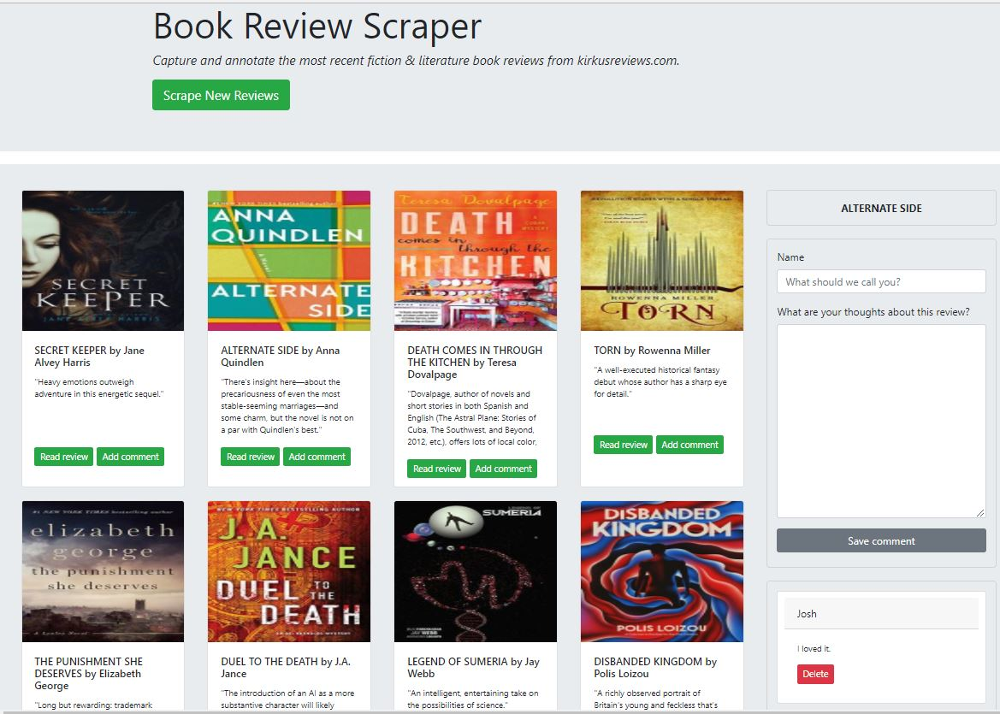

# Review Scraper

### Overview 

This application was created to practice web-scraping, as well the use of a NoSQL database, and their integration within a full-stack application. Users are able to scrape new book reviews from the Kirkus Book Reviews website, and dynamically add and delete related comments to the screen and to the database. 

* Node.js - an event-driven, asynchronous JavaScript open source server framework

* NPM packages - Including express, for creating the server; mongoDB for creating and interacting with the NoSQL database; Cheerio for traversing the source website markup; Axios for making promise-based HTTP requests to the source website, body-parser, for interpreting and reading data; method-override; and express-handlebars.

* MySQL Workbench - for creating the local database connection

* Handlebars - a JavaScript templating framework to manage the display of data returned by the server

* MVC design - Model View Controller refers to a method of structuring a web development project into disticnt but interconnected parts increasing efficiency and resusability of code.

* ODM - The Mongoose Object Data Model (Mongoose) library was used for managing the application's CRUD interactions with the database.

* Heroku - the cloud platform used to deploy the application

See a screenshot below for a glimpse of the final product, or click [here](https://polar-shelf-50004.herokuapp.com/) to view and use live app.

